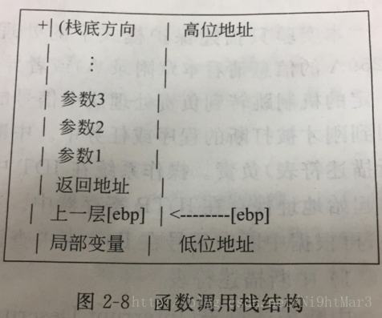

# __ucore 实验lab1__

## __一、实验目的:__

&emsp;&emsp;操作系统是一个软件，也需要通过某种机制加载并运行它。本实验将通过另外一个更加简单的软件-bootloader来完成这些工作。为此，需要完成一个能够切换到x86的保护模式并显示字符的bootloader，为启动操作系统ucore做准备。lab1提供了一个非常小的bootloader和ucore OS，整个bootloader执行代码小于512个字节，这样才能放到硬盘的主引导扇区中。通过分析和实现这个bootloader和ucore OS，可以了解到：

- 计算机原理
  - CPU的编址与寻址: 基于分段机制的内存管理
  - CPU的中断机制
  - 外设：串口/并口/CGA，时钟，硬盘

- Bootloader软件
  - 编译运行bootloader的过程
  - 调试bootloader的方法
  - PC启动bootloader的过程
  - ELF执行文件的格式和加载
  - 外设访问：读硬盘，在CGA上显示字符串

- ucore OS软件
  - 编译运行ucore OS的过程
  - ucore OS的启动过程
  - 调试ucore OS的方法
  - 函数调用关系：在汇编级了解函数调用栈的结构和处理过程
  - 中断管理：与软件相关的中断处理
  - 外设管理：时钟

## __二、实验内容：__

&emsp;&emsp;lab1中包含一个bootloader和一个OS。这个bootloader可以切换到X86保护模式，能够读磁盘并加载ELF执行文件格式，并显示字符。而这lab1中的OS只是一个可以处理时钟中断和显示字符的幼儿园级别OS。

## __三、实验原理与步骤__

### __练习1__

_理解通过make生成执行文件的过程。（要求在报告中写出对下述问题的回答)_

_列出本实验各练习中对应的OS原理的知识点，并说明本实验中的实现部分如何对应和体现了原理中的基本概念和关键知识点。_
_在此练习中，大家需要通过静态分析代码来了解:_  
_1. 操作系统镜像文件ucore.img是如何一步一步生成的？(需要比较详细地解释Makefile中每一条相关命令和命令参数的含义，以及说明命令导致的结果)_  
_2. 一个被系统认为是符合规范的硬盘主引导扇区的特征是什么?_

练习1,需要理解ucore.img是如何一步一步生成的，则就要阅读makefile文件，工程的makefile文件非常复杂，需要读懂非常困难，我在网上看到了一篇博客写得非常详细的：[ucore实验lab1练习1](https://www.shiyanlou.com/courses/reports/1054572)  
在根目录打开makefile文件中，找到生成ucore.img的部分
```makefile
# create ucore.img
UCOREIMG	:= $(call totarget,ucore.img)

$(UCOREIMG): $(kernel) $(bootblock)
	$(V)dd if=/dev/zero of=$@ count=10000
	$(V)dd if=$(bootblock) of=$@ conv=notrunc
	$(V)dd if=$(kernel) of=$@ seek=1 conv=notrunc
```
可以发现在上述最为主要的信息是 $(UCOREIMG): $(kernel) $(bootblock)，说明ccore.img依赖kernel 和 bootblock。
三行的生成代码分别代表三个地方的代码拷贝到相应的UCOREIMG中来
接下来接着看bootblock和kernel分别是如何生成的，同样看makefile文件中相应的描述：
```makefile
bootfiles = $(call listf_cc,boot)
$(foreach f,$(bootfiles),$(call cc_compile,$(f),$(CC),$(CFLAGS) -Os -nostdinc))
bootblock = $(call totarget,bootblock)

$(bootblock): $(call toobj,$(bootfiles)) | $(call totarget,sign)
	@echo + ld $@
	$(V)$(LD) $(LDFLAGS) -N -e start -Ttext 0x7C00 $^ -o $(call toobj,bootblock)
	@$(OBJDUMP) -S $(call objfile,bootblock) > $(call asmfile,bootblock)
	@$(OBJDUMP) -t $(call objfile,bootblock) | $(SED) '1,/SYMBOL TABLE/d; s/ .* / /; /^$$/d' > $(call symfile,bootblock)
	@$(OBJCOPY) -S -O binary $(call objfile,bootblock) $(call outfile,bootblock)
	@$(call totarget,sign) $(call outfile,bootblock) $(bootblock)
```
从地三行开始是bootfiles的主要生成部分，bootblock的依赖文件主要这里分成了两个，两个之一都可以满足条件：
- 前一个的作用是调用了toobj函数，实现了在.o文件前加obj 前缀的功能
- 而第二个是在依赖文件sign前加bin。所以此处还应该涉及到另一个bootblock的依赖文件sign

在sign.c中有如下代码：
```c
    char buf[512];
    memset(buf, 0, sizeof(buf));
    FILE *ifp = fopen(argv[1], "rb");
    int size = fread(buf, 1, st.st_size, ifp);
    if (size != st.st_size) {
        fprintf(stderr, "read '%s' error, size is %d.\n", argv[1], size);
        return -1;
    }
    fclose(ifp);
    buf[510] = 0x55;
    buf[511] = 0xAA;
```
&emsp;&emsp;由以上代码可知，主引导扇区的大小是512字节，并且第511个字节是0x55,第511个字节是0xAA

### __练习3__
分析bootloader 进入保护模式的过程。

从`%cs=0 $pc=0x7c00`，进入后

首先清理环境：包括将flag置0和将段寄存器置0
```s
	.code16
	    cli
	    cld
	    xorw %ax, %ax
	    movw %ax, %ds
	    movw %ax, %es
	    movw %ax, %ss
```

开启A20：通过将键盘控制器上的A20线置于高电位，全部32条地址线可用，
可以访问4G的内存空间。
```s
	seta20.1:               # 等待8042键盘控制器不忙
	    inb $0x64, %al      # 
	    testb $0x2, %al     #
	    jnz seta20.1        #
	
	    movb $0xd1, %al     # 发送写8042输出端口的指令
	    outb %al, $0x64     #
	
	seta20.1:               # 等待8042键盘控制器不忙
	    inb $0x64, %al      # 
	    testb $0x2, %al     #
	    jnz seta20.1        #
	
	    movb $0xdf, %al     # 打开A20
	    outb %al, $0x60     # 
```

初始化GDT表：一个简单的GDT表和其描述符已经静态储存在引导区中，载入即可
```s
	    lgdt gdtdesc
```

进入保护模式：通过将cr0寄存器PE位置1便开启了保护模式
```s
	    movl %cr0, %eax
	    orl $CR0_PE_ON, %eax
	    movl %eax, %cr0
```

通过长跳转更新cs的基地址
```s
	 ljmp $PROT_MODE_CSEG, $protcseg
	.code32
	protcseg:
```

设置段寄存器，并建立堆栈
```s
	    movw $PROT_MODE_DSEG, %ax
	    movw %ax, %ds
	    movw %ax, %es
	    movw %ax, %fs
	    movw %ax, %gs
	    movw %ax, %ss
	    movl $0x0, %ebp
	    movl $start, %esp
```
转到保护模式完成，进入boot主方法
```s
	    call bootmain
```
### __练习4__
分析bootloader加载ELF格式的OS的过程。

首先看readsect函数，
`readsect`从设备的第secno扇区读取数据到dst位置
```c
	static void
	readsect(void *dst, uint32_t secno) {
	    waitdisk();
	
	    outb(0x1F2, 1);                         // 设置读取扇区的数目为1
	    outb(0x1F3, secno & 0xFF);
	    outb(0x1F4, (secno >> 8) & 0xFF);
	    outb(0x1F5, (secno >> 16) & 0xFF);
	    outb(0x1F6, ((secno >> 24) & 0xF) | 0xE0);
	        // 上面四条指令联合制定了扇区号
	        // 在这4个字节线联合构成的32位参数中
	        //   29-31位强制设为1
	        //   28位(=0)表示访问"Disk 0"
	        //   0-27位是28位的偏移量
	    outb(0x1F7, 0x20);                      // 0x20命令，读取扇区
	
	    waitdisk();

	    insl(0x1F0, dst, SECTSIZE / 4);         // 读取到dst位置，
	                                            // 幻数4因为这里以DW为单位
	}
```
&emsp;&emsp;关于四条指令中的第一个参数有如下的解释：  
  
readseg简单包装了readsect，可以从设备读取任意长度的内容。

```c
	static void
	readseg(uintptr_t va, uint32_t count, uint32_t offset) {
	    uintptr_t end_va = va + count;
	
	    va -= offset % SECTSIZE;
	
	    uint32_t secno = (offset / SECTSIZE) + 1; 
	    // 加1因为0扇区被引导占用
	    // ELF文件从1扇区开始
	
	    for (; va < end_va; va += SECTSIZE, secno ++) {
	        readsect((void *)va, secno);
	    }
	}
```
&emsp;&emsp;

在bootmain函数中，
```c
	void
	bootmain(void) {
	    // 首先读取ELF的头部
	    readseg((uintptr_t)ELFHDR, SECTSIZE * 8, 0);
	
	    // 通过储存在头部的幻数判断是否是合法的ELF文件
	    if (ELFHDR->e_magic != ELF_MAGIC) {
	        goto bad;
	    }
	
	    struct proghdr *ph, *eph;
	
	    // ELF头部有描述ELF文件应加载到内存什么位置的描述表，
	    // 先将描述表的头地址存在ph
	    ph = (struct proghdr *)((uintptr_t)ELFHDR + ELFHDR->e_phoff);
	    eph = ph + ELFHDR->e_phnum;
	
	    // 按照描述表将ELF文件中数据载入内存
	    for (; ph < eph; ph ++) {
	        readseg(ph->p_va & 0xFFFFFF, ph->p_memsz, ph->p_offset);
	    }
	    // ELF文件0x1000位置后面的0xd1ec比特被载入内存0x00100000
	    // ELF文件0xf000位置后面的0x1d20比特被载入内存0x0010e000

	    // 根据ELF头部储存的入口信息，找到内核的入口
	    ((void (*)(void))(ELFHDR->e_entry & 0xFFFFFF))();
	
	bad:
	    outw(0x8A00, 0x8A00);
	    outw(0x8A00, 0x8E00);
	    while (1);
	}
```
&emsp;&emsp;由readseg函数读取硬盘扇区,读取完磁盘之后，开始加载ELF格式的文件。先判断是不是ELF，然后定义ph为** ELF 段表首地址，eph 为 **ELF 段表末地址,将ELF头部的描述表读取出来将之存入，依次将ELF文件写入内存，最后根据描述表的信息找到入口运行。如果失败将陷入循环。

&emsp;&emsp;链接视图通过Section Header Table描述，执行视图通过Program Header Table描述。Section Header Table描述了所有Section的信息，包括所在的文件偏移和大小等；Program Header Table描述了所有Segment的信息，即Text Segment, Data Segment和BSS Segment，每个Segment中包含了一个或多个Section。
&emsp;&emsp;对于加载可执行文件，只需关注执行视图，即解析ELF文件，遍历Program Header Table中的每一项，把每个Program Header描述的Segment加载到对应的虚拟地址即可，然后从ELF header中取出Entry的地址，跳转过去就开始执行了。对于ELF格式的内核文件来说，这个工作就需要由Bootloader完成。


### 练习5 ：实现函数调用堆栈跟踪函数

实验指导书中提示看课本，课本中关于堆栈的表述如下：  
  
课本的解释如下：  
&emsp;&emsp;这两条汇编指令的含义是：首先将ebp 寄存器入栈，然后将栈顶指针 esp 赋值给 ebp。movl %esp %ebp这条指令表面上看是用esp覆盖 ebp原来的值，其实不然。因为给 ebp赋值之前，原ebp 值已经被压栈（位于栈顶），而新的ebp又恰恰指向栈顶。此时ebp寄存器就已经处于一个非常重要的地位，该寄存器中存储着栈中的一个地址（原 ebp入栈后的栈顶），从该地址为基准，向上（栈底方向）能获取返回地址、参数值，向下（栈顶方向）能获取函数局部变量值，而该地址处又存储着上一层函数调用时的ebp值。  
&emsp;&emsp;一般而言，ss:[ebp+4]处为返回地址（即调用时的 eip），ss:[ebp+8]处为第一个参数值（最后一个入栈的参数值，此处假设其占用4字节内存），ss:[ebp-4]处为第一个局部变量，ss:[ebp]处为上一层ebp值。由于ebp中的地址处总是“上一层函数调用时的ebp值”，而在每一层函数调用中，都能通过当时的ebp值“向上（栈底方向）”能获取返回地址、参数值，“向下（栈顶方向）”能获取函数局部变量值。如此形成递归，直至到达栈底。这就是函数调用栈。
```cpp
uint32_t ebp = read_ebp();
uint32_t eip = read_eip();

int i = 0;
for(i = 0; i < STACKFRAME_DEPTH && ebp != 0; i++){
    cprintf("ebp:0x%08x eip:0x%08x", ebp, eip);
    uint32_t *argu = (uint32_t *)ebp + 2;
    cprintf("argument:0x%8x 0x%8x 0x%08x 0x%08x", argu[0], argu[1], argu[2], argu[3]);
    cprintf("\n");
    print_debuginfo(eip - 1);
    eip = ((uint32_t *)ebp)[1];
    ebp = ((uint32_t *)ebp)[0];v
```
#### 实验结果


### 实验6
- 6.1 中断描述符表一个表项占8字节。其中0-15位和48-63位分别是offset偏移量的低16位和高16位。16-31位是段选择子，通过段选择子来获得基地址，加上偏移量即可获得终端处理程序的入口地址。  

- 6.2 
打开kern/trap/trap.c找到idt_init()函数


实验添加的代码如下：
```cpp
 //获取IDT表的入口地址
extern uint32_t __vectors[];
int i = 0;
for(i = 0; i < 256; i++){
    //建立中断描述符表
    if(i != T_SYSCALL)
    {
        SETGATE(idt[i], 0, GD_KTEXT, __vectors[i], DPL_KERNEL);
    }
    SETGATE(idt[T_SWITCH_TOK], 0, GD_KTEXT, __vectors[T_SWITCH_TOK], DPL_USER);
    //通过lidt指令完成中断描述符表的加载
    lidt(&idt_pd);
} 
```
首先查看需要填入代码的部分：

添加的代码如下所示：

```cpp
ticks++;
if(ticks == TICK_NUM)
{
    ticks = 0;
    print_ticks();
}
break;
```

