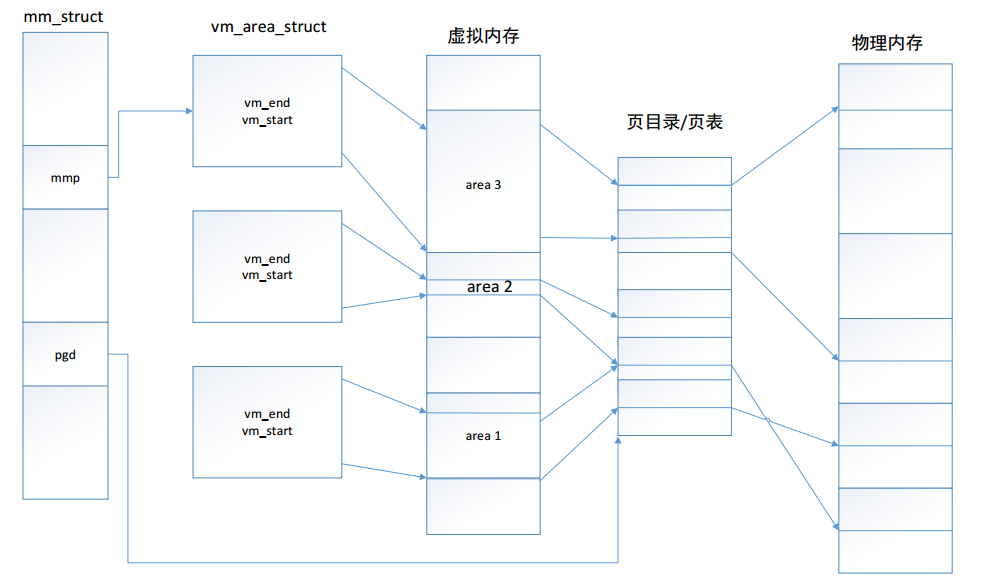
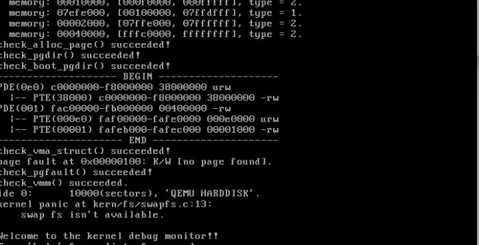

# __UCORE lab3 虚拟内存管理__

&emsp;&emsp;`根据ucore实验报告要求，本实验报告采用markdown格式，在转化为pdf时，其中的网络链接与文本格式均相对于原文出现一定程度的改变，请查看markdown格式实验报告Github链接：`  

[Ucore 实验报告Github](https://github.com/HanlongLiao/Course/tree/master/OS/%E5%AE%9E%E9%AA%8C%E5%85%AD%20UCore)  
[查看更多OS实验报告](https://github.com/HanlongLiao/Course/tree/master/OS)


&emsp;&emsp;做完实验二后，可以了解并掌握物理内存管理中的连续空间分配算法的具体实现以及如何建立二级页表。本次实验是在实验二的基础上，借助于页表机制和实验一中涉及的中断异常处理机制，完成Page
Fault异常处理和FIFO页替换算法的实现。实验原理最大的区别是在设计了如何在磁盘上缓存内存页，从而能够支持虚存管理，提供一个比实际物理内存空间“更大”的虚拟内存空间给系统使用。

## __一、实验目的__

* 了解虚拟内存的Page Fault异常处理实现
* 了解页替换算法在操作系统中的实现


## __二、实验内容__

&emsp;&emsp;本次实验是在实验二的基础上，借助于页表机制和实验一中涉及的中断异常处理机制，完成Page
Fault异常处理和FIFO页替换算法的实现，结合盘提供的缓存空间，从而能够支持虚存管理，提供一个比实际物理内存空间“更大”的虚拟内存空间给系统使用。这个实验与实际操作系统中的实现比较起来要简单，不过需要了解实验一和实验二的具体实现。实际操作系统系统中的虚拟内存管理设计与实现是相当复杂的，涉及到与进程管理系统、文件系统等的交叉访问。如果大家有余力，可以尝试完成扩展练习，实现extended　clock页替换算法。

## __三、实验原理与实验步骤__
### __3.1 实验相关原理__
#### __3.1.1 虚拟内存管理__
&emsp;&emsp;在操作系统中，虚拟内存包含多个虚拟层次，在不同的层次体现了不同的作用。首先，在有了分页机制后，程序员或CPUs“看到”的地址已经不是实际的物理地址了，这已经有一层虚拟化，可简称为内存地址虚拟化。有了内存地址虚拟化，可以通过设置页表项来限定软件运行时的访问空间，确保软件运行不越界，完成内存访问保护的功能。

&emsp;&emsp;通过内存地址虚拟化，可以使得软件在没有访问某虚拟内存地址时不分配具体的物理内存，而只有在实际访问某虚拟内存地址时，操作系统再动态地分配物理内存，建立虚拟内存到物理内存的页映射关系，这种技术称为按需分页（demand paging）。把不经常访问的数据所占的内存空间临时写到硬盘上，这样可以腾出更多的空闲内存空间给经常访问的数据；当CPU访问到不经常访问的数据时，再把这些数据从硬盘读入到内存中，这种技术称为页换入换出（page　swap in/out）。这种内存管理技术给了程序员更大的内存“空间”，从而可以让更多的程序在内存中并发运行。  
#### __3.1.2 Page Fault异常处理__

&emsp;&emsp;实现虚存管理的一个关键是page fault异常处理，其过程中主要涉及到函数 -- do\_pgfault的具体实现。比如，在程序的执行过程中由于某种原因（页框不存在/写只读页等）而使 CPU 无法最终访问到相应的物理内存单元，即无法完成从虚拟地址到物理地址映射时，CPU 会产生一次页访问异常，从而需要进行相应的页访问异常的中断服务例程。这个页访问异常处理的时机被操作系统充分利用来完成虚存管理，即实现“按需调页”/“页换入换出”处理的执行时机。当相关处理完成后，页访问异常服务例程会返回到产生异常的指令处重新执行，使得应用软件可以继续正常运行下去。

&emsp;&emsp;具体而言，当启动分页机制以后，如果一条指令或数据的虚拟地址所对应的物理页框不在内存中或者访问的类型有错误（比如写一个只读页或用户态程序访问内核态的数据等），就会发生页访问异常。产生页访问异常的原因主要有：

*  目标页帧不存在（页表项全为0，即该线性地址与物理地址尚未建立映射或者已经撤销)；
*  相应的物理页帧不在内存中（页表项非空，但Present标志位=0，比如在swap分区或磁盘文件上)，这在本次实验中会出现，我们将在下面介绍换页机制实现时进一步讲解如何处理；
*  不满足访问权限(此时页表项P标志=1，但低权限的程序试图访问高权限的地址空间，或者有程序试图写只读页面).

&emsp;&emsp;当出现上面情况之一，那么就会产生页面page fault（\#PF）异常。CPU会把产生异常的线性地址存储在CR2中，并且把表示页访问异常类型的值（简称页访问异常错误码，errorCode）保存在中断栈中。

&emsp;&emsp;CR2是页故障线性地址寄存器，保存最后一次出现页故障的全32位线性地址。CR2用于发生页异常时报告出错信息。当发生页异常时，处理器把引起页异常的线性地址保存在CR2中。操作系统中对应的中断服务例程可以检查CR2的内容，从而查出线性地址空间中的哪个页引起本次异常。(对于此部分内容，请参考《微机原理与接口技术》王娟等，清华大学出版社 第三章)

&emsp;&emsp;产生页访问异常后，CPU硬件和软件都会做一些事情来应对此事。首先页访问异常也是一种异常，所以针对一般异常的硬件处理操作是必须要做的，即CPU在当前内核栈保存当前被打断的程序现场，即依次压入当前被打断程序使用的EFLAGS，CS，EIP，errorCode；由于页访问异常的中断号是0xE，CPU把异常中断号0xE对应的中断服务例程的地址（vectors.S中的标号vector14处）加载到CS和EIP寄存器中，开始执行中断服务例程。这时ucore开始处理异常中断，首先需要保存硬件没有保存的寄存器。在vectors.S中的标号vector14处先把中断号压入内核栈，然后再在trapentry.S中的标号\_\_alltraps处把DS、ES和其他通用寄存器都压栈。自此，被打断的程序执行现场（context）被保存在内核栈中。接下来，在trap.c的trap函数开始了中断服务例程的处理流程，大致调用关系为：

> trap--\> trap\_dispatch--\>pgfault\_handler--\>do\_pgfault

下面需要具体分析一下do\_pgfault函数。do\_pgfault的调用关系如下图所示：


&emsp;&emsp;产生页访问异常后，CPU把引起页访问异常的线性地址装到寄存器CR2中，并给出了出错码errorCode，说明了页访问异常的类型。ucore OS会把这个值保存在struct trapframe 中tf\_err成员变量中。而中断服务例程会调用页访问异常处理函数do\_pgfault进行具体处理。这里的页访问异常处理是实现按需分页、页换入换出机制的关键之处。

&emsp;&emsp;ucore中do\_pgfault函数是完成页访问异常处理的主要函数，它根据从CPU的控制寄存器CR2中获取的页访问异常的物理地址以及根据errorCode的错误类型来查找此地址是否在某个VMA的地址范围内以及是否满足正确的读写权限，如果在此范围内并且权限也正确，这认为这是一次合法访问，但没有建立虚实对应关系。所以需要分配一个空闲的内存页，并修改页表完成虚地址到物理地址的映射，刷新TLB，然后调用iret中断，返回到产生页访问异常的指令处重新执行此指令。如果该虚地址不在某VMA范围内，则认为是一次非法访问。
#### __3.1.3 页面置换算法__


&emsp;&emsp;由于操作系统给用户态的应用程序提供了一个虚拟的“大容量”内存空间，而实际的物理内存空间相对很小。根据程序的局部性原理，操作系统只将当前程序及其局部得到指令存储到内存中，而不常用的数据和代码放在了硬盘这样的存储介质上。如果cpu当前访问的程序或者数据在内存中，则不出现问题，但当应用程序访问它认为应该在内存中的的数据或指令时，会产生页访问异常。这时，操作系统必须能够应对这种页访问异常，即尽快把应用程序当前需要的数据或代码放到内存中来，然后重新执行应用程序产生异常的访存指令。如果在把硬盘中对应的数据或代码调入内存前，操作系统发现物理内存已经没有空闲空间了，这时操作系统必须把它认为“不常用”的页换出到磁盘上去，以腾出内存空闲空间给应用程序所需的数据或代码。

&emsp;&emsp;操作系统迟早会碰到没有内存空闲空间而必须要置换出内存中某个“不常用”的页的情况。如何判断内存中哪些是“常用”的页，哪些是“不常用”的页，把“常用”的页保持在内存中，在物理内存空闲空间不够的情况下，把“不常用”的页置换到硬盘上就是页替换算法着重考虑的问题。容易理解，一个好的页替换算法会导致页访问异常次数少，也就意味着访问硬盘的次数也少，从而使得应用程序执行的效率就高。

* 先进先出(First In First Out, FIFO)页替换算法：该算法总是淘汰最先进入内存的页，即选择在内存中驻留时间最久的页予以淘汰。只需把一个应用程序在执行过程中已调入内存的页按先后次序链接成一个队列，队列头指向内存中驻留时间最久的页，队列尾指向最近被调入内存的页。这样需要淘汰页时，从队列头很容易查找到需要淘汰的页。FIFO算法只是在应用程序按线性顺序访问地址空间时效果才好，否则效率不高。因为那些常被访问的页，往往在内存中也停留得最久，结果它们因变“老”而不得不被置换出去。FIFO算法的另一个缺点是，它有一种异常现象（Belady现象），即在增加放置页的页帧的情况下，反而使页访问异常次数增多。

* 时钟（Clock）页替换算法：是LRU算法的一种近似实现。时钟页替换算法把各个页面组织成环形链表的形式，类似于一个钟的表面。然后把一个指针（简称当前指针）指向最老的那个页面，即最先进来的那个页面。另外，时钟算法需要在页表项（PTE）中设置了一位访问位来表示此页表项对应的页当前是否被访问过。当该页被访问时，CPU中的MMU硬件将把访问位置“1”。当操作系统需要淘汰页时，对当前指针指向的页所对应的页表项进行查询，如果访问位为“0”，则淘汰该页，如果该页被写过，则还要把它换出到硬盘上；如果访问位为“1”，则将该页表项的此位置“0”，继续访问下一个页。该算法近似地体现了LRU的思想，且易于实现，开销少，需要硬件支持来设置访问位。时钟页替换算法在本质上与FIFO算法是类似的，不同之处是在时钟页替换算法中跳过了访问位为1的页。

* 改进的时钟（Enhanced Clock）页替换算法：在时钟置换算法中，淘汰一个页面时只考虑了页面是否被访问过，但在实际情况中，还应考虑被淘汰的页面是否被修改过。因为淘汰修改过的页面还需要写回硬盘，使得其置换代价大于未修改过的页面，所以优先淘汰没有修改的页，减少磁盘操作次数。改进的时钟置换算法除了考虑页面的访问情况，还需考虑页面的修改情况。即该算法不但希望淘汰的页面是最近未使用的页，而且还希望被淘汰的页是在主存驻留期间其页面内容未被修改过的。这需要为每一页的对应页表项内容中增加一位引用位和一位修改位。当该页被访问时，CPU中的MMU硬件将把访问位置“1”。当该页被“写”时，CPU中的MMU硬件将把修改位置“1”。这样这两位就存在四种可能的组合情况：（0，0）表示最近未被引用也未被修改，首先选择此页淘汰；（0，1）最近未被使用，但被修改，其次选择；（1，0）最近使用而未修改，再次选择；（1，1）最近使用且修改，最后选择。该算法与时钟算法相比，可进一步减少磁盘的I/O操作次数，但为了查找到一个尽可能适合淘汰的页面，可能需要经过多次扫描，增加了算法本身的执行开销。

### __3.2 实验步骤__
#### __3.2.1 练习0__
>_填写已有的实验
本实验依赖于实验1和实验2，请把要做的实验1实验2的代码填入本实验中代码有lab1，lab2的注释相应部分_
首先利用meld工具比较两个文件的差异  

&emsp;&emsp;发现缺失的是kdebug.c、trap.c、default_pmm.c、pmm.c四个文件的相关代码

#### __3.2.2 练习1__
>_给未被映射的地址映射上物理页(需要编程)_   
  _完成 do_pgfault（mm/vmm.c）函数，给未被映射的地址映射上物理页。设置访问权限的时候需要参考页面所在VMA的权限，同时需要注意映射物理页时需要操作内存控制结构所制定的页表，而不是内核的页表。_

&emsp;&emsp;do_pgfault函数是完成页错误异常处理的主要函数，他根据从CPU的控制寄存器CR2中获取的页错误异常的虚拟地址，以及根据error code的错误类型来查找次虚拟地址是否在某个VMA(VMA在UCORE中定义请查看[**VMA定义**]())的地址范围内，并且是否满足正确的读写权限，如果在此范围内并且权限也正确，就认为这是一次合法访问，但没有建立虚实对应关系，所以需要分配一个空闲的内存页，并修改页表完成虚地址到物理地址的映射，刷新TLB，然后调用iret中断，返回并重新执行。如果该虚地址不在某VMA范围内，这认为是一个非法访问，下列是内存的页与物理块的对应图例（mm_struct在UCORE中的定义请查看[**mm_struct定义**](./picture/lab3_mm_struct.md )）：  



&emsp;&emsp;根据[**注释**](./picture/lab3_do_pgfault.md)与[**定义**](./picture/lab3_1_page.md)产生页错误时，证明进程想访问的物理页是不存在的，也就是page table中的page table entry中的值并不能推断出一个物理页的存在，此时的pte的内容有两种情况：
* uintptr_t pte = 0，即page table entry中是没有内容的；那么就说明**虚拟内存页**还没有载入过代码或是数据(如果之前载入过代码那么这个pte就是一个swap entry);此时的操作就直接申请一个物理内存页并构建pte及快表即可。代码如下：
```c
if (0 == *ptep) {                                                            
        if (NULL == pgdir_alloc_page(mm->pgdir, addr, perm))                     
        {                                                                        
           cprintf("call pgdir_alloc_page failed in do_pgfault.\n");             
           goto failed;                                                          
        }                                                                        
    }
```

* uintptr_t pte != 0,即page table entry中有内容，但是不是物理页的物理地址;此时pte存储的是swap entry中的内容，用来映射交换分区中存储的指令或者数据。代码如下：
```c
    else {                                                                       
        if (swap_init_ok) {                                                      
            struct Page *page = NULL;                                            
            //uintptr_t phy_addr;                                                
            ret = swap_in(mm, addr, &page);                                      
            if (0 != ret)                                                        
            {                                                                    
                cprintf("call swap_in failed in do_pgfault.\n");                 
                goto failed;                                                     
            }                                                                    
                                                                                 
            //now the page table entry is converted to real page table entry from
            //swap_entry                                                         
            //phy_addr = page2pa(page);                                          
            page_insert(mm->pgdir, page, addr, perm);                            
            //*ptep = phy_addr | PTE_P | perm;                                   
                                                                                 
            swap_map_swappable(mm, addr, page, 0);                               
        }                                                                        
        else {                                                                   
            cprintf("no swap_init_ok but ptep is %x, failed\n, *ptep");          
        }                                                                        
    }       
```

&emsp;&emsp;通过每个进程建立一个page directory来维护一个虚拟地址空间，如果某个虚拟地址初次访问的时产生page fauly，那么就直接创建一个物理页并填充pte及相应的快表即可；如果某个虚拟地址访问出现page fault但是其linear address对应的pte其实是有值的，那么这个值就是swap entry，这是因为我们采用虚拟内存管理，就需要及时地将某些暂时不使用的物理内存页还给操作系统，但是为了后期还能继续使用这个物理页上的数据(毕竟一个程序的指令或者数据都是可以并可能重复使用的)，我们就将这个物理页上的数据暂时存放在磁盘空间上。

&emsp;&emsp;放置到磁盘上了之后，为了在下次可以快速地找到这个页的所有数据呢，这个时候就要重复利用一个pte了,为了下次这个linear address产生page fault时可以继续读取原来的数据（这里我们假定这个数据当时时存储在了交换分区的n~n+7个sector上，因为一个页为4KB，一个sector为512B，因此一个页相当于8个sector），我们在pte中存储交换分区中这个n值，下次再缺页时通过这个pte上的offset值就可以直接准确地将数据从磁盘上写回物理内存上；
#### __3.2.2 练习2__

>_补充完成基于FIFO的页面替换算法（需要编程）_ 
  _完成vmm.c中的do_pgfault函数，并且在实现FIFO算法的swap_fifo.c中完成map_swappable和swap_out_victim函数。通过对swap的测试_

&emsp;&emsp;在这个练习中，需要了解一下页面的置换机制。在页面替换过程中，仅仅只是考虑页面替换的算法是仅仅不够的，h还需要考虑一些其他的问题：

* 哪些页可以被换出？
* 一个虚拟的页如何与硬盘上的扇区建立对应关系？
* 何时进行换入和换出操作？
* 如何设计数据结构以支持页替换算法？
* 如何完成页的换入换出操作？

&emsp;&emsp;实验3仅仅只是实现了简单的页面替换,其实并没有实现一个真正的内存页面替换的功能，更多细节请查看（[**页面替换机制**](./picture/lab3_2_page_swap.md)）

&emsp;&emsp;根据练习1，当页错误异常发生时，有可能是因为页面保存在swap区或者磁盘文件上造成的，所以我们需要利用页面替换算法解决这个问题。  
&emsp;&emsp;页面替换主要分为两个方面，页面换出和页面换入。 
- 页面换入主要在上述的do_pgfault()函数实现； 
- 页面换出主要在swap_out_vistim()函数实现。

&emsp;&emsp;在换入时，需要先检查产生访问异常的地址是否属于某个VMA表示的合法虚拟地址，并且保存在硬盘的swap文件中（即对应的PTE的高24位不为0，而最低位为0），则是执行页换入的时机，将调用swap_in函数完成页面换入。

&emsp;&emsp;在换出时，采取的是消极的换出策略，是在调用alloc_pages函数获取空闲页时，此函数如果发现无法从物理内存页分配器（比如First Fit）获得空闲页，就会进一步调用swap_out函数 换出某页，实现一种消极的换出策略。

- __dopgfault__  

查看相应的[**注释**](./picture/lab3_dofault.md)填写代码：
```C
else 
    { // if this pte is a swap entry, then load data from disk to a page with phy addr
           // and call page_insert to map the phy addr with logical addr
        if(swap_init_ok)
         {//页表项非空，根据mm结构和addr地址，尝试将硬盘中的内容换入page中
            struct Page *page=NULL;
            ret = swap_in(mm, addr, &page);
            if (ret != 0) 
            {
                cprintf("swap_in in do_pgfault failed\n");
                goto failed;
            } 
        //建立虚拟地址和物理地址之间的对应关系   
            page_insert(mm->pgdir, page, addr, perm);
        //将此页面设置为可交换
            swap_map_swappable(mm, addr, page, 1);
            page->pra_vaddr = addr;
        }
        else
         {
            cprintf("no swap_init_ok but ptep is %x, failed\n",*ptep);
            goto failed;
        }
   }
```


- __fifo_map_swappable()__

 &emsp;&emsp;首先是_fifo_map_swappable，可用于建立页访问属性和关系，比如访问时间的先后顺序。
 查看相应的[**注释**](./picture/lab3_fifo_map_swappable.md)
 完善的代码如下：  
 ```C
 /*
 * (3)_fifo_map_swappable: According FIFO PRA, we should link the most recent arrival page at the back of pra_list_head qeueue
 */
static int
_fifo_map_swappable(struct mm_struct *mm, uintptr_t addr, struct Page *page, int swap_in)
{
    list_entry_t *head=(list_entry_t*) mm->sm_priv;
    list_entry_t *entry=&(page->pra_page_link);

    assert(entry != NULL && head != NULL);
    //record the page access situlation
    /*LAB3 EXERCISE 2: YOUR CODE*/ 
    //(1)link the most recent arrival page at the back of the pra_list_head qeueue.
    //将最近用到的页面添加到次序的队尾
    list_add(head, entry);
    return 0;
}
 ```

  

- **_fifo_swap_out_victim()**  

&emsp;&emsp;_fifo_swap_out_victim用于实现挑选出要换出的页。

根据[**注释**](./picture/lab3_fifo_swap_victim.md)补充代码：

```C
static int
_fifo_swap_out_victim(struct mm_struct *mm, struct Page ** ptr_page, int in_tick)
{
     list_entry_t *head=(list_entry_t*) mm->sm_priv;
         assert(head != NULL);
     assert(in_tick==0);
     /* Select the victim */
     /*LAB3 EXERCISE 2: YOUR CODE*/ 
     //(1)  unlink the  earliest arrival page in front of pra_list_head qeueue
     //(2)  set the addr of addr of this page to ptr_page
     /* Select the tail */
     //指出需要被换出的页
     list_entry_t *le = head->prev;
     assert(head != le);
     //le2page 宏可以根据链表元素，获得对应page的指针
     struct Page *p = le2page(le, pra_page_link);
     //将进来最早的页面从队列中删除
     list_del(le);
     assert(p != NULL);
     //将这一页的地址存储在ptr_page中
     *ptr_page = p;
     return 0;
}
```
## __四、运行结果__  

## __五、收获__
&emsp;&emsp;通过本次实验，了解物理内存管理中的连续空间分配算法的具体实现，了解了Page Fault异常处理，FIFO页替换算法，页面替换的机制的实现。在实际的过程中，遇到了很多问题，阅读与参考了大量的文档，通过这个实验，对后续去做一些其他的实验奠定了一定的基础。
